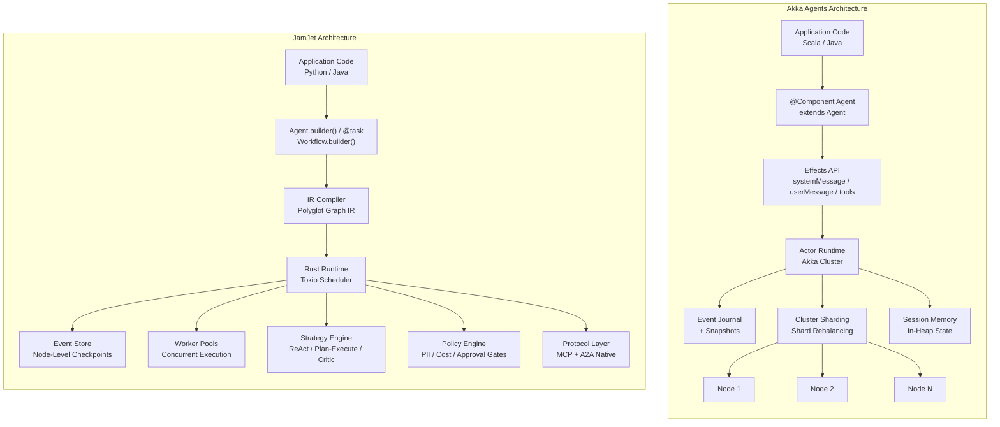
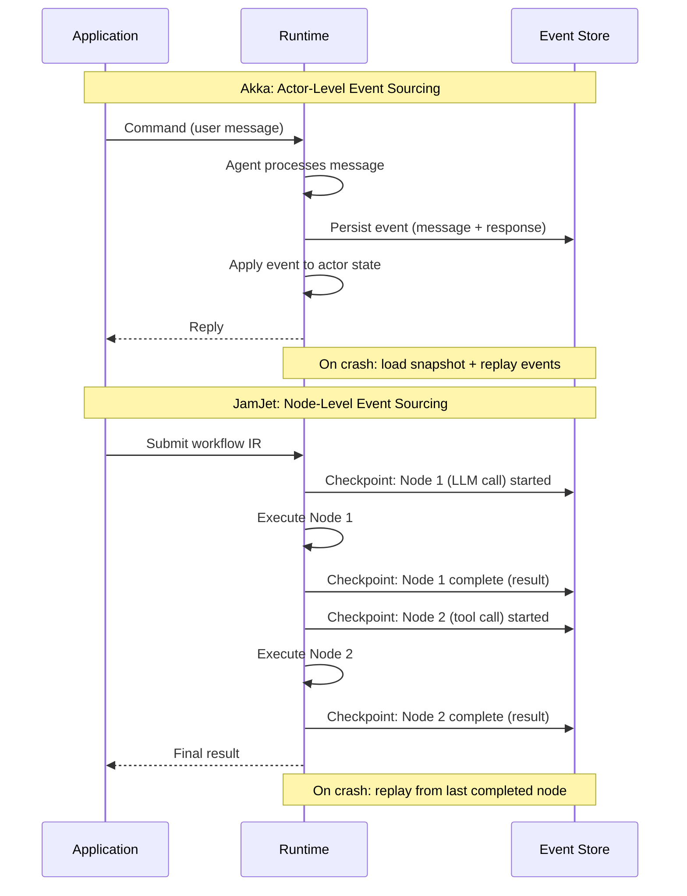
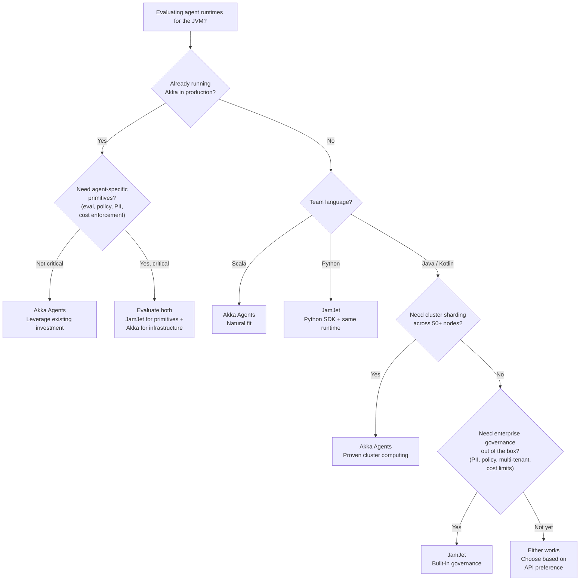

# Akka Agents vs JamJet: Actor Model or Agent-Native Runtime?

*Two approaches to the same problem: making AI agents production-grade on the JVM. Akka adapted 20 years of distributed-systems infrastructure for agents. JamJet was purpose-built for agents from day one. Both do event sourcing. The difference is the abstraction you build on.*

If you are evaluating agent runtimes for enterprise JVM workloads, these two will end up on your shortlist. Both are serious. Both are opinionated. And they make fundamentally different bets about what AI agents need from infrastructure.

This post is an honest architectural comparison — where each wins, where each falls short, and how to choose between them.

---

## Two philosophies, one problem

The production problem is real: 67% of organizations experiment with AI agents, but only 11% have deployed them in production ([KPMG, mid-2025](https://kpmg.com/us/en/articles/2025/ai-quarterly-pulse-survey.html)). The gap is infrastructure — crash recovery, state persistence, audit trails, cost controls, human-in-the-loop. Both Akka Agents and JamJet close this gap. They just start from very different foundations.

**Akka's thesis:** The actor model already solved distributed state, resilience, and message-driven concurrency. Adapt it for AI agents. Leverage 20 years of proven infrastructure — cluster sharding, event journals, passivation — and add agent-specific features on top.

**JamJet's thesis:** AI agents are a new category of software. They need purpose-built primitives — reasoning strategies, coordinator routing, eval harnesses, cost enforcement, protocol interop — as first-class concepts in the runtime, not bolted onto a general-purpose distributed framework.

Neither thesis is wrong. They serve different contexts.

---

## Akka's approach: actors as agents

Akka Agents is part of the broader [Akka Agentic AI Platform](https://www.akka.io/blog/news-akka-introduces-agentic-ai-platform), which includes four integrated components: Akka Agents (goal-directed agents), Akka Memory (durable in-memory state), Akka Streaming (real-time data pipelines), and Akka Orchestration (multi-agent workflows).

The core model: each agent is a component backed by an event-sourced actor. You define an agent by extending the `Agent` class, implement command handlers that return declarative `Effect` objects, and the runtime handles state persistence, session memory, and tool invocation.

Here is what Akka brings to the table:

- **Actor model foundation.** Message-driven behavior, location transparency, fault isolation through supervision hierarchies. If one agent crashes, others are unaffected.
- **Event journal + snapshots.** Every state change persists as an immutable event. Periodic snapshots optimize recovery — on restart, the runtime loads the latest snapshot and replays subsequent events.
- **Cluster sharding.** Agent instances distribute automatically across cluster nodes. As nodes join or leave, shards rebalance transparently. This is battle-tested at massive scale.
- **Automatic passivation.** Idle agents get their state offloaded to durable storage, freeing heap memory. When a message arrives, the agent rehydrates. Essential for systems with millions of dormant agents.
- **Sub-millisecond reads.** While an agent is active, its state lives on the JVM heap. No database round-trip for reads.
- **Managed deployment.** Integration with Google Vertex AI Agent Engine gives you production deployment with Google's SLA.
- **MCP + A2A support.** Agents can expose functions as MCP endpoints and participate in multi-agent collaboration.

Akka's agent model benefits from two decades of production hardening in banking, telecommunications, and gaming. That trust takes time to build, and it is real.

---

## JamJet's approach: agents as first-class primitives

JamJet is not an adaptation of existing infrastructure. It is a runtime built specifically for AI agent workloads. The [core is Rust + Tokio](/blog/why-rust-for-ai-workflows/). The authoring surface is Python and Java. The key architectural decision: agents, workflows, tools, strategies, and protocols are native concepts in the runtime — not actors adapted for AI use.

Here is what that means concretely:

- **Graph-based workflow IR.** Agent definitions in Python or Java compile to a canonical intermediate representation — a serializable graph of typed nodes and edges. The Rust runtime executes this IR with full durability. This polyglot IR means the same agent can be authored in Python or Java and run on the same runtime.
- **Progressive API.** Three entry points for different complexity levels: `@task` (a single durable function), `Agent.builder()` (a stateful entity with model, tools, and identity), and `Workflow.builder()` (a full DAG with conditional routing, fan-out, and eval loops). You start simple and add structure as your use case demands.
- **Built-in reasoning strategies.** ReAct, plan-and-execute, critic, reflection, consensus, and debate are built into the runtime. You set a strategy with `.strategy("plan-and-execute")` — no need to implement reasoning loops yourself.
- **CoordinatorNode.** Dynamic multi-agent routing with structured scoring and LLM tiebreaker. The coordinator evaluates which agent should handle a request based on capability, cost, and context — not manual message routing.
- **Agent-as-Tool.** Three invocation modes: synchronous, streaming with early termination, and conversational with turn limits. Agents can use other agents as tools, composing complex behaviors without custom wiring.
- **Eval harness.** LLM judge, assertion-based scoring, and custom scorer plugins — as workflow nodes, not external scripts. Evaluation runs during execution and can route: retry if quality is low, branch to a different strategy, or halt if gates are not met.
- **Policy engine.** Tool blocking, autonomy enforcement, approval gates. Define what agents can and cannot do at runtime, not in application code.
- **PII redaction + data governance.** Mask, hash, or remove sensitive data with configurable retention policies. Built into the runtime, not a middleware layer.
- **Multi-tenant isolation.** Row-level partitioning for state and events. Each tenant's data is isolated at the storage layer.
- **Cost enforcement.** Runtime-level budget limits per agent or workflow. Set `.maxCostUsd(0.50)` and the runtime enforces it.
- **Native MCP + A2A.** Both client and server, integrated into the execution graph. Protocol interactions are nodes in the workflow, not external calls.

The argument is not that JamJet does everything Akka does but better. It is that AI agents need agent-specific primitives as built-in concepts, and a runtime designed for agents can provide them without the impedance mismatch of adapting a general-purpose distributed framework.

---

## Architecture comparison



The structural difference is visible in the diagram. Akka's architecture flows through the actor model — agents are actors, state is actor state, distribution is cluster sharding. Everything maps to actors.

JamJet's architecture flows through a workflow IR — agents compile to typed graphs, the Rust runtime executes nodes with per-node checkpointing, and agent-specific subsystems (strategies, policies, protocols, eval) are native components of the runtime, not layered on top of a generic distributed framework.

---

## Side-by-side code: a durable research agent

Same use case in both: an agent with a web search tool, configured for durability. Let us be fair about both.

### Akka Agents (Java)

```java
// Agent definition — extends Agent, uses @ComponentId
@ComponentId("research-agent")
public class ResearchAgent extends Agent {

    private static final String SYSTEM_PROMPT = """
        You are a research assistant. Search for information
        before answering. Provide thorough, sourced summaries.
        """;

    // Tool defined via @FunctionTool annotation
    @FunctionTool
    @Description("Search the web for information")
    public String webSearch(@Description("search query") String query) {
        return searchApi.search(query);
    }

    // Command handler returns declarative Effect
    public Effect<String> research(String question) {
        return effects()
            .systemMessage(SYSTEM_PROMPT)
            .userMessage(question)
            .tools(this)              // register tools from this class
            .thenReply();
    }
}
```

```properties
# application.conf — model and memory configuration
akka.javasdk {
  agent {
    model-provider = openai
    openai.model-name = "gpt-4o"
  }
  agent.memory {
    enabled = true
    limited-window.max-size = 156KiB
  }
  event-sourced-entity.snapshot-every = 100
}
```

**What is clean here:** The `@FunctionTool` annotation is elegant. Tool definitions live right on the agent class. The Effects API is declarative — you describe what you want, not how to wire it. Session memory is configuration, not code. If your team already thinks in actors and components, this is a natural extension.

### JamJet (Java)

```java
// Tool defined as a Java record with @Tool annotation
@Tool(description = "Search the web for information")
record WebSearch(String query) implements ToolCall<String> {
    public String execute() {
        return searchApi.search(query);
    }
}

// Agent built with fluent API — no base class, no actor system
var agent = Agent.builder("researcher")
        .model("gpt-4o")
        .tools(WebSearch.class)
        .instructions("""
            You are a research assistant. Search for information
            before answering. Provide thorough, sourced summaries.
            """)
        .strategy("react")            // built-in reasoning strategy
        .maxIterations(5)              // iteration guard
        .maxCostUsd(0.50)             // runtime cost ceiling
        .timeoutSeconds(120)           // hard time limit
        .build();

// Compile to IR and run — durability is automatic
var ir = agent.compile();
var result = agent.run("What is the state of AI on the JVM?");
```

**What is clean here:** No base class to extend, no actor system to configure, no infrastructure annotations. The progressive API means you write 12 lines of Java to get a durable agent with a reasoning strategy, cost ceiling, and timeout. Tools are records — plain data classes. The `compile()` step produces a workflow IR graph that the Rust runtime executes with per-node checkpointing.

### The real difference

Both examples produce a durable research agent. The difference is what comes next.

In Akka, adding multi-agent routing means designing actor message protocols and implementing a Workflow component to orchestrate collaboration. Adding cost tracking means building it. Adding evaluation means integrating external tooling.

In JamJet, multi-agent routing is `CoordinatorNode`. Cost tracking is `.maxCostUsd()`. Evaluation is an `EvalNode` in the workflow graph. These are not application-level concerns — they are runtime primitives.

---

## Durability model comparison

Both systems use event sourcing. The granularity is different.



**Akka's model:** Events are at the actor message level. A command arrives, the agent processes it (potentially making multiple LLM calls and tool invocations within one command), and the result persists as an event. Snapshots periodically capture full state.

**JamJet's model:** Events are at the workflow node level. Each node in the execution graph — each LLM call, each tool invocation, each eval step — gets its own checkpoint. If the runtime crashes between node 3 and node 4 of a 10-node workflow, it replays the results of nodes 1-3 from the event store and resumes at node 4.

The practical implication: if an Akka agent crashes mid-command while processing its third tool call, the entire command replays. If a JamJet workflow crashes mid-execution, only the incomplete node re-executes. For long-running agent workflows with expensive LLM calls, the granularity difference is meaningful — both in recovery time and in cost (you do not re-execute completed LLM calls).

---

## Where Akka wins

Being honest about this makes the comparison useful.

**Cluster computing at scale.** If you need hundreds of agent instances distributed across a cluster with automatic rebalancing, Akka's cluster sharding is battle-tested. Financial systems and gaming platforms have run it at massive scale for years. JamJet uses worker pools, not cluster sharding — different architecture, different scaling characteristics.

**20-year track record.** Akka powers transaction-processing systems in banking, telecommunications networks, and gaming platforms. That institutional trust takes time to build. JamJet is one year old.

**State passivation.** Akka automatically offloads idle agent state from memory and rehydrates it when needed. If you have millions of dormant agents that occasionally receive messages, passivation is critical for memory management. JamJet does not have this — its model is workflow-oriented, not long-lived-actor-oriented.

**Managed deployment.** Vertex AI Agent Engine integration means production deployment with Google's SLA, monitoring, and operations support. JamJet is self-hosted (Docker, Kubernetes) with a managed offering planned but not yet available.

**Streaming infrastructure.** Akka Streams provides backpressure-aware data pipelines for real-time processing — audio, video, metrics, event streams. This is mature, proven infrastructure. JamJet is workflow-oriented, not stream-processing-oriented.

**Scala ecosystem integration.** If your team already runs Akka in production and thinks in actors, the learning curve for Akka Agents is near zero. Same mental model, same operational tooling, same deployment patterns.

---

## Where JamJet wins

**Agent-native primitives.** Strategies (ReAct, plan-and-execute, critic, reflection, consensus, debate), CoordinatorNode for dynamic multi-agent routing, Agent-as-Tool with three invocation modes, Agent Cards for discovery — these are built-in runtime concepts. In Akka, you implement reasoning loops, routing logic, and agent composition in application code.

**Progressive API.** `@task` for a single durable function. `Agent.builder()` for a stateful agent. `Workflow.builder()` for a full DAG. You choose your entry point based on complexity. Akka requires understanding the component model (agents, entities, workflows, endpoints) from the start.

**Polyglot SDKs.** Python and Java compile to the same IR. Your Python ML team and Java backend team can author agents that run on the same runtime. Akka is a JVM framework — Java and Scala, but no Python.

**In-process execution.** `pip install jamjet` or add a Maven dependency. Run locally. No actor system, no cluster, no infrastructure to set up. Akka requires an ActorSystem, configuration, and typically a deployment platform.

**Built-in eval harness.** LLM judge, assertion-based scoring, custom scorer plugins — as nodes in the workflow graph. Evaluation runs during execution and routes based on results. Akka provides observability (OpenTelemetry), but evaluation and quality gates are application-level concerns.

**Policy engine.** Tool blocking, autonomy enforcement, approval gates — configured at the runtime level. Define what agents can and cannot do independent of application code. Akka does not have a built-in policy engine.

**PII redaction and data governance.** Mask, hash, or remove sensitive data with retention policies, built into the runtime. Not available in Akka.

**Multi-tenant isolation.** Row-level partitioning for state and events. Not available in Akka.

**Cost enforcement.** Set `.maxCostUsd(0.50)` and the runtime enforces the budget across all LLM calls in the workflow. Akka does not track or enforce LLM costs.

**License.** JamJet is Apache 2.0. No usage restrictions, no commercial license required. This matters for some organizations and procurement teams.

---

## Decision matrix

| Dimension | Akka Agents | JamJet |
|-----------|-------------|--------|
| **Core abstraction** | Actor model | Graph-based workflow IR |
| **Primary language** | Java / Scala | Java + Python (polyglot IR) |
| **Runtime** | JVM (Akka runtime) | Rust (Tokio) |
| **Durability granularity** | Actor message level | Workflow node level |
| **Agent strategies** | Application code | Built-in (react, plan-execute, critic, reflection, consensus, debate) |
| **Multi-agent routing** | Workflow component + actor messaging | CoordinatorNode (scoring + LLM tiebreaker) |
| **Agent-as-Tool** | Not built-in | 3 modes (sync, streaming, conversational) |
| **MCP support** | Client + Server | Client + Server |
| **A2A support** | Client + Server | Client + Server |
| **Eval / testing** | Observability (OTel) | Eval harness + replay testing + custom scorers |
| **Policy engine** | Not built-in | Tool blocking, autonomy enforcement, approval gates |
| **PII / governance** | Not built-in | Mask / hash / remove, retention policies |
| **Multi-tenant** | Not built-in | Row-level isolation |
| **Cost enforcement** | Not built-in | Runtime-level budget limits |
| **Cluster scaling** | Cluster sharding (proven at scale) | Worker pools |
| **State passivation** | Automatic (idle agents offloaded) | Not applicable (workflow-oriented) |
| **Local development** | Requires ActorSystem + config | In-process, zero infrastructure |
| **Managed deployment** | Vertex AI Agent Engine (Google SLA) | Docker / self-hosted (managed planned) |
| **Streaming** | Akka Streams (backpressure-aware) | Not a focus |
| **License** | BSL 1.1 | Apache 2.0 |
| **Maturity** | 20 years (Akka), ~1 year (Agents) | ~1 year |
| **Best for** | Teams with Akka/Scala expertise, massive cluster scale | Teams wanting agent-native primitives, Python or Java |

---

## When to choose which



### Choose Akka Agents if:

- **Your team already runs Akka in production.** The operational knowledge, monitoring, and deployment patterns transfer directly. Adding agent capabilities to an existing Akka stack is lower risk than introducing a new runtime.
- **You need cluster sharding across many nodes today.** If your workload requires distributing hundreds of agent instances across a cluster with automatic rebalancing and failover, Akka's cluster sharding is proven at scale.
- **Your team knows Scala and thinks in actors.** The actor model is a powerful abstraction. If it matches your team's mental model, Akka Agents is a natural extension.
- **You need managed deployment via Google Cloud.** Vertex AI Agent Engine gives you production deployment with SLA, monitoring, and Google's operational support.
- **You have millions of dormant agents.** Akka's automatic passivation handles memory management for long-lived, mostly-idle agent populations.

### Choose JamJet if:

- **You want agent-specific primitives built in.** Reasoning strategies, coordinator routing, eval harnesses, cost enforcement, and policy engines — as runtime concepts, not application code you write and maintain.
- **Your team writes Python or Java, not Scala.** JamJet's polyglot IR means Python ML engineers and Java backend developers author agents that run on the same runtime.
- **You need enterprise governance out of the box.** PII redaction, policy enforcement, multi-tenant isolation, and approval gates — configured at the runtime level, not built per-application.
- **You want to start local and scale to production.** `pip install jamjet` or a Maven dependency. No actor system, no cluster configuration, no infrastructure to set up on day one.
- **Open-source licensing matters.** Apache 2.0 with no usage restrictions.

---

## Closing

Both Akka Agents and JamJet are serious production runtimes. The question is not which is "better" — it is which abstraction matches how you think about AI agents.

If you see agents as distributed actors that happen to call LLMs, Akka is a natural fit. It brings 20 years of battle-tested infrastructure and a proven path to massive scale. The actor model is powerful, and Akka's agent layer is a pragmatic extension of it.

If you see agents as a new category of software that needs purpose-built primitives — strategies, eval, cost enforcement, protocol interop, governance — JamJet was designed for that from day one. The runtime understands what agents are, not just what actors do.

We built JamJet because we believe the second thesis. But we respect the first. Choose the one that matches your context.

---

**Further reading:**

- [Agentic AI architecture patterns](https://sunilprakash.com/agentic-ai) — deeper dive into agent design patterns
- [Why we built JamJet](/blog/why-we-built-jamjet/) — the origin story and the demo-to-production gap
- [Why Rust for AI workflows](/blog/why-rust-for-ai-workflows/) — why the runtime is not on the JVM
- [AI agents in the Java ecosystem](/blog/jamjet-java-ai-ecosystem/) — landscape of every JVM AI framework
- [JamJet Java quickstart](https://docs.jamjet.dev/en/docs/java-quickstart) — running your first agent in 10 minutes
- [JamJet Spring Boot starter](https://docs.jamjet.dev/en/docs/spring-boot-starter) — integration with Spring AI and LangChain4j
- [Akka introduces Agentic AI Platform](https://www.akka.io/blog/news-akka-introduces-agentic-ai-platform) — Akka's official announcement
- [Akka Memory: durable, in-memory, and sharded](https://www.akka.io/blog/akka-memory-durable-in-memory-and-sharded-data) — Akka's durability model explained
- [Akka Agents: MCP, gRPC, and APIs](https://www.akka.io/blog/akka-agents-quickly-create-agents-mcp-grpc-api) — Akka's agent creation approach
